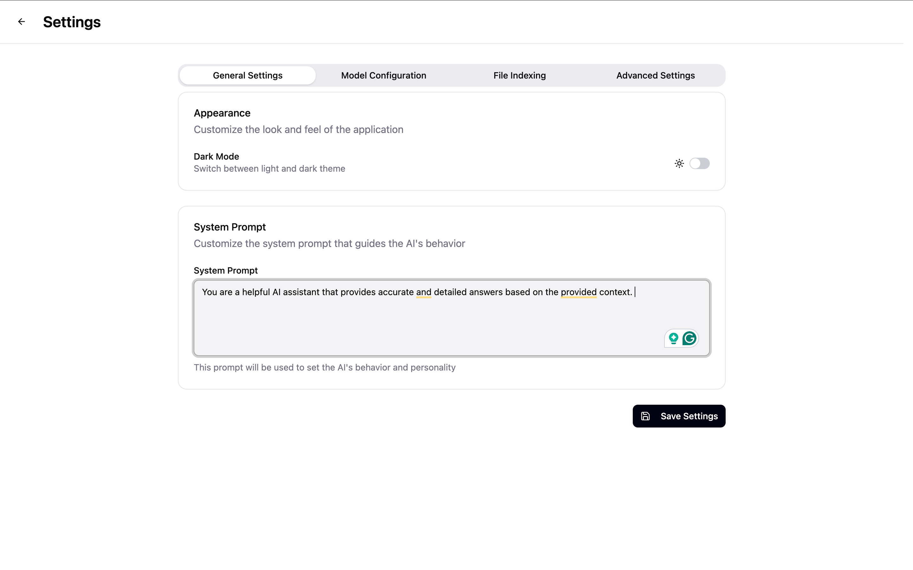
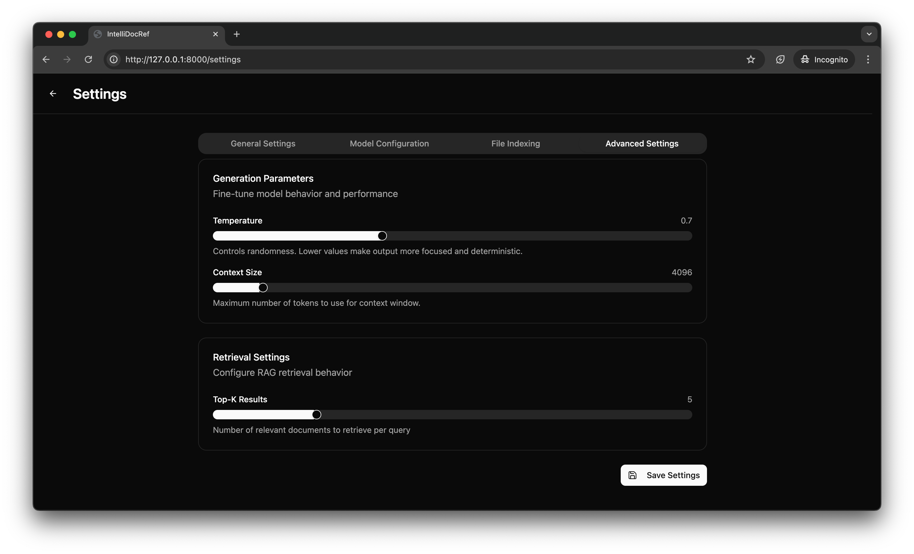

# Intelligent Document Reference

Local-first RAG app for document ingestion and citation-grounded Q&A.

- Backend: FastAPI
- Frontend: React/Vite
- Storage: SQLite + sqlite-vec


https://github.com/user-attachments/assets/0f393843-5a50-45bc-98cb-ad8d31f009bb


## Quick Start (Production)

**Prerequisites:** `uv` — [github.com/astral-sh/uv](https://github.com/astral-sh/uv?tab=readme-ov-file#installation)

Run command:

```bash
uv run app.py
```

Default app URL: http://127.0.0.1:8000

## Configuration (UI First)

Use the Settings UI in the app to configure:
1. System Prompt
2. Embedding/Inference Model
3. API Keys
4. Model Temperature & Context Size
5. Retrieval Top-K Results





Optionally, you may use an environment file to do this [.env.example](.env.example).

---

## Development

**Prerequisites:** Node.js 22+ — [nodejs.org](https://nodejs.org/)

Run commands:

```bash
uv run app.py --setup
uv run app.py --dev
uv run app.py --dev --reset  # reset state before startup
```

Optionally, run Electron mini-mode helper (**experimental**):

```bash
uv run app.py --dev --electron
```

For all available flags:

```bash
uv run app.py --help
```

## Contributing

```bash
uv sync --group dev					# install test dependencies
uv run scripts/cspyformatter.py  	# run formatting
uv run pytest						# run all tests
cd ui && npm run build				# rebuild distribution files after UI changes 
```

## Troubleshooting

| Problem | Fix |
|---|---|
| Port already in use | `uv run app.py --port 8080` |
| Frontend not loading in production | `uv run app.py --setup` |
| Reset local DB/indexing state | `uv run app.py --reset` |
| Folder picker unavailable | See [docs/TKINTER_SETUP.md](docs/TKINTER_SETUP.md) |
